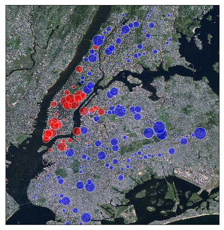
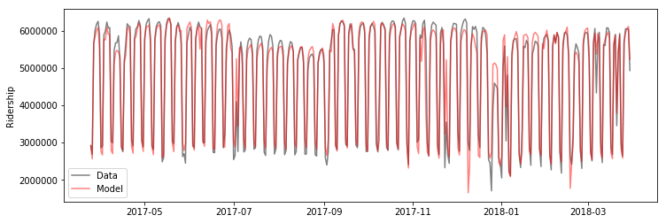

# MTA Turnstile Data
Analysis of New York City Subway Ridership Data

[View jupyter notebook here](https://nbviewer.jupyter.org/github/christopherbronner/MTA_Turnstile_Data/blob/master/MTA_ridership.ipynb)

In this notebook, I analyze data from turnstiles in

